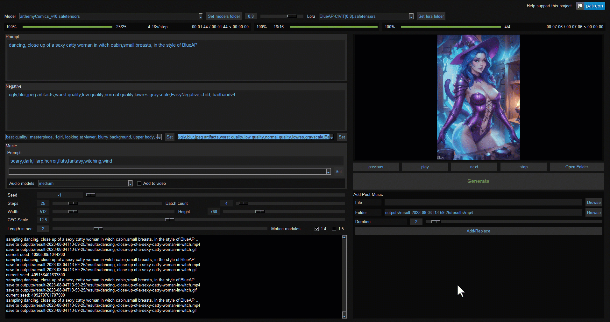
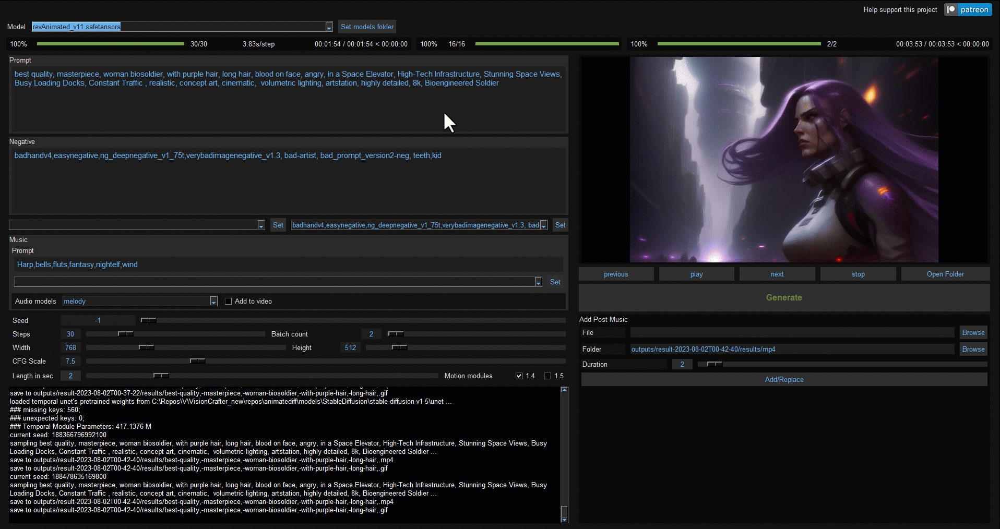
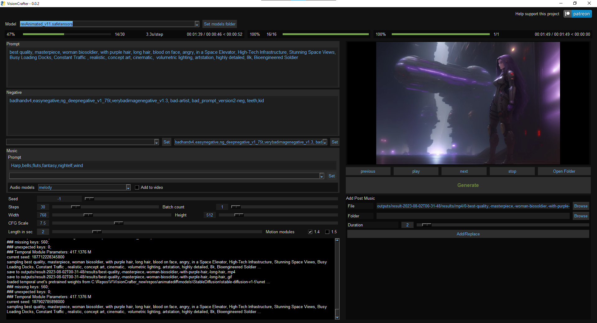

<!-- Improved compatibility of back to top link: See: https://github.com/othneildrew/Best-README-Template/pull/73 -->
<a name="readme-top"></a>
<!--
*** Thanks for checking out the Best-README-Template. If you have a suggestion
*** that would make this better, please fork the repo and create a pull request
*** or simply open an issue with the tag "enhancement".
*** Don't forget to give the project a star!
*** Thanks again! Now go create something AMAZING! :D
-->
<!--
*** I'm using markdown "reference style" links for readability.
*** Reference links are enclosed in brackets [ ] instead of parentheses ( ).
*** See the bottom of this document for the declaration of the reference variables
*** for contributors-url, forks-url, etc. This is an optional, concise syntax you may use.
*** https://www.markdownguide.org/basic-syntax/#reference-style-links
-->
<br />
<div align="center">

[](https://www.patreon.com/distyx)

<!--  -->

  <h1 align="center">VisionCrafter</h1>
  <h4 align="center"><em>Craft your visions</em></h4>
  <h4 align="center">Don't forget to leave a star.</h4>
  
  
  <p align="center">
    <a href="https://github.com/diStyApps/VisionCrafter/issues">Report Bug</a>
  </p>
</div>


<!-- TABLE OF CONTENTS -->
<details>
  <summary>Table of Contents</summary>
  <ol>
    <li>
      <a href="#about-the-project">About The Project</a>
    </li>
    <li><a href="#requirements">Requirements</a></li>
    <li><a href="#contact">Contact</a></li>
    <li><a href="#my-other-projects">My Other Projects</a></li>    
    <li><a href="#acknowledgments">Acknowledgments</a></li>

    
  </ol>
</details>

<!-- ABOUT THE PROJECT -->
## About The Project

VisionCrafter tool with GUI for AnimateDiff and other projects, that generates animations and music from text.

Ideal for producing short videos and GIFs, as well as creating brief cinematic scenes.

### Update [0.0.5] 

Added interrupt button, a bit buggy but better then nothing for now.

### Update [0.0.4] 

Saving options: mp4 (default), GIF, individual frames.

Extended animation limit to 60 seconds (caution: time-consuming and may not yield desired results).

Share your work on https://www.reddit.com/r/visioncrafter, created by [@yavuzitconsulting](https://github.com/yavuzitconsulting). You can also find helpful guides and additional information there.






<p align="right">(<a href="#readme-top">back to top</a>)</p>

<!-- Requirements -->
## Requirements
 - Windows 10+ and Nvidia GPU-based cards 
  - - 12VRAM+ Recommend: 3090/4090
 - VLC 64bit https://get.videolan.org/vlc/3.0.18/win64/vlc-3.0.18-win64.exe
<p align="right">(<a href="#readme-top">back to top</a>)</p>


<!-- Requirements -->
## Download And Install
 - Install [SEAIT](https://github.com/diStyApps/seait), choose VisionCrafter from the list, and click 'install'.

 Or git clone

 ```
git clone https://github.com/diStyApps/VisionCrafter
```
 - To install: 0_Install_VisionCrafter.bat
 - To run: 1_Run_VisionCrafter.bat 

<p align="right">(<a href="#readme-top">back to top</a>)</p>


## Gallery
<table class="center">
    <tr>
    <td></td>
    <td></td>
    <td></td>
    <td></td>
    </tr>
</table>
<table class="center">
    <tr>
    <td></td>
    <td></td>
    <td></td>
    <td></td>
    </tr>
</table>
<table class="center">
    <tr>
    <td></td>
    <td></td>
    <td></td>
    <td></td>
    </tr>
</table>
<table class="center">
    <tr>
    <td></td>
    <td></td>
    <td></td>
    <td></td>
    </tr>
</table>
<table class="center">
    <tr>
    <td></td>
    <td></td>
    <td></td>
    <td></td>
    </tr>
</table>
<table class="center">
    <tr>
    <td></td>
    <td></td>
    <td></td>
    <td></td>
    </tr>
</table>
<table class="center">
    <tr>
    <td></td>
    <td></td>
    <td></td>
    <td></td>
    </tr>
</table>

<!-- <p style="margin-left: 2em; margin-top: -1em">Model：<a href="https://civitai.com/models/30240/toonyou">ToonYou</a></p> -->


<!-- CONTACT -->
## Contact

distty@gmail.com


<p align="right">(<a href="#readme-top">back to top</a>)</p>

<!-- MY OTHER PROJECTS -->
## My Other Projects

[SEAIT](https://github.com/diStyApps/seait)

[FaceSwapSuite](https://github.com/diStyApps/FaceSwapSuite)

[VisualClipPicker](https://github.com/diStyApps/VisualClipPicker)

[Stable-Diffusion-Pickle-Scanner-GUI](https://github.com/diStyApps/Stable-Diffusion-Pickle-Scanner-GUI)

[Safe-and-Stable-Ckpt2Safetensors-Conversion-Tool-GUI](https://github.com/diStyApps/Safe-and-Stable-Ckpt2Safetensors-Conversion-Tool-GUI)


<p align="right">(<a href="#readme-top">back to top</a>)</p>

<!-- ACKNOWLEDGMENTS -->
## Acknowledgments


* [AnimateDiff](https://github.com/guoyww/AnimateDiff)
* [audiocraft](https://github.com/facebookresearch/audiocraft)
* [Tune-A-Video](https://github.com/showlab/Tune-A-Video)

<p align="right">(<a href="#readme-top">back to top</a>)</p>


<!-- MARKDOWN LINKS & IMAGES -->
<!-- https://www.markdownguide.org/basic-syntax/#reference-style-links -->
[contributors-shield]: https://img.shields.io/github/contributors/othneildrew/Best-README-Template.svg?style=for-the-badge
[contributors-url]: https://github.com/othneildrew/Best-README-Template/graphs/contributors
[forks-shield]: https://img.shields.io/github/forks/othneildrew/Best-README-Template.svg?style=for-the-badge
[forks-url]: https://github.com/othneildrew/Best-README-Template/network/members
[stars-shield]: https://img.shields.io/github/stars/othneildrew/Best-README-Template.svg?style=for-the-badge
[stars-url]: https://github.com/othneildrew/Best-README-Template/stargazers
[issues-shield]: https://img.shields.io/github/issues/othneildrew/Best-README-Template.svg?style=for-the-badge
[issues-url]: https://github.com/othneildrew/Best-README-Template/issues
[license-shield]: https://img.shields.io/github/license/othneildrew/Best-README-Template.svg?style=for-the-badge
[license-url]: https://github.com/othneildrew/Best-README-Template/blob/master/LICENSE.txt
[linkedin-shield]: https://img.shields.io/badge/-LinkedIn-black.svg?style=for-the-badge&logo=linkedin&colorB=555
[linkedin-url]: https://linkedin.com/in/othneildrew
[product-screenshot]: images/screenshot.png
[Next.js]: https://img.shields.io/badge/next.js-000000?style=for-the-badge&logo=nextdotjs&logoColor=white
[Next-url]: https://nextjs.org/
[React.js]: https://img.shields.io/badge/React-20232A?style=for-the-badge&logo=react&logoColor=61DAFB
[React-url]: https://reactjs.org/
[Vue.js]: https://img.shields.io/badge/Vue.js-35495E?style=for-the-badge&logo=vuedotjs&logoColor=4FC08D
[Vue-url]: https://vuejs.org/
[Angular.io]: https://img.shields.io/badge/Angular-DD0031?style=for-the-badge&logo=angular&logoColor=white
[Angular-url]: https://angular.io/
[Svelte.dev]: https://img.shields.io/badge/Svelte-4A4A55?style=for-the-badge&logo=svelte&logoColor=FF3E00
[Svelte-url]: https://svelte.dev/
[Laravel.com]: https://img.shields.io/badge/Laravel-FF2D20?style=for-the-badge&logo=laravel&logoColor=white
[Laravel-url]: https://laravel.com
[Bootstrap.com]: https://img.shields.io/badge/Bootstrap-563D7C?style=for-the-badge&logo=bootstrap&logoColor=white
[Bootstrap-url]: https://getbootstrap.com
[JQuery.com]: https://img.shields.io/badge/jQuery-0769AD?style=for-the-badge&logo=jquery&logoColor=white
[JQuery-url]: https://jquery.com 


